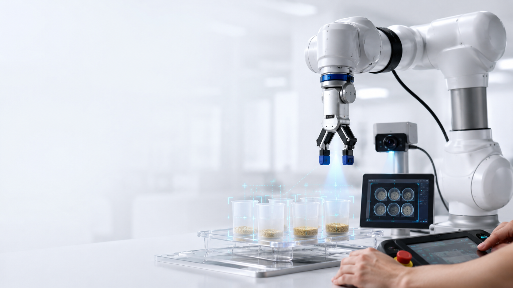
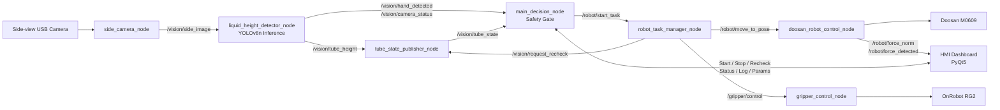
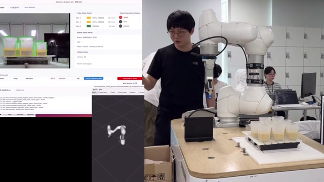
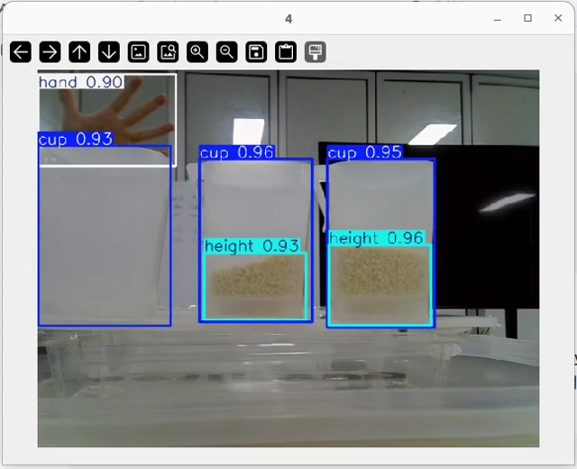
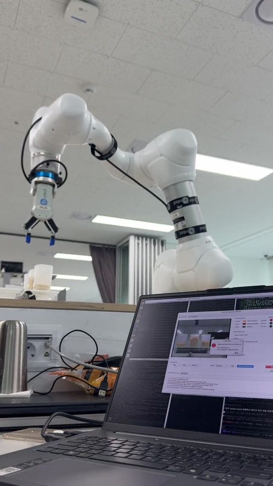
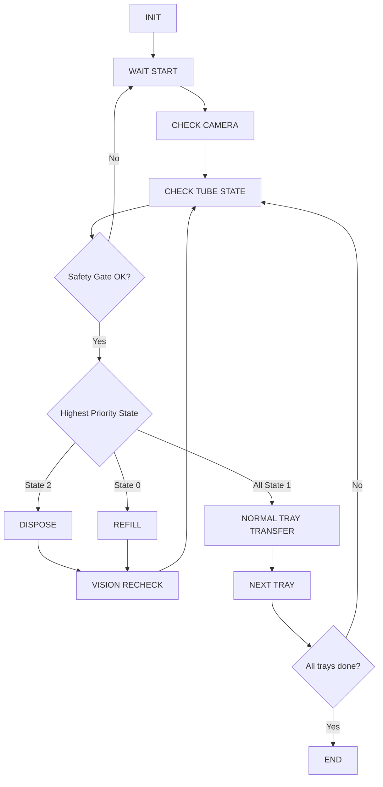
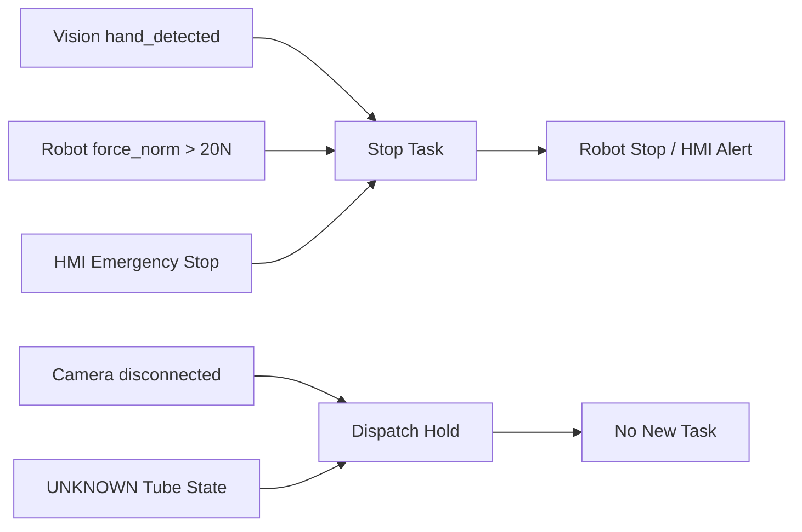

<!--
  README asset guide
  - Recommended cover image path: assets/images/alas_cover.png
  - Recommended demo paths:
    - assets/demo/full_scenario_10x.mp4
    - assets/demo/realtime_inference_yolov8n.mp4
    - assets/demo/force_stop.mp4
-->

<div align="center">

<!-- Place the project cover image at assets/images/alas_cover.png to enable this preview. -->


# ALAS: Vision AI 기반 시약 자동 관리 협동로봇 시스템

### AI Laboratory Assistant System

**YOLOv8 + ROS2 Humble + Doosan M0609 + OnRobot RG2 기반 실험실 자동화 파이프라인**


</div>

---

## 1. Project Overview

**ALAS**는 실험실의 반복적인 시약 상태 확인, 보충, 폐기, 정상 트레이 이송 작업을 자동화하기 위한 Vision-AI 기반 협동로봇 시스템입니다.

카메라가 시약통을 촬영하면 YOLOv8n 모델이 `cup`, `height`, `hand`를 검출하고, ROS2 노드가 시약 높이를 상태값으로 변환합니다. 이후 Main Decision Node와 Robot Task Manager가 상태와 안전 조건을 확인한 뒤, Doosan M0609 협동로봇과 RG2 그리퍼가 **보충(Refill)**, **폐기(Dispose)**, **정상 트레이 이송(Normal Transfer)** 작업을 수행합니다.

```text
Camera → YOLOv8n Inference → Tube State Decision → ROS2 Communication → Robot Task → HMI Monitoring
```

### Core Idea

> “카메라가 보고, AI가 판단하고, 로봇이 행동한다.”

이 프로젝트는 단순한 객체 검출 데모가 아니라, **Vision 결과가 실제 로봇 작업 시퀀스와 연결되는 End-to-End 자동화 파이프라인**을 목표로 합니다.

---

## 2. Problem & Motivation

실험실 시약 관리 과정에서는 다음과 같은 문제가 발생할 수 있습니다.

- 작업자별 육안 판단 차이로 인한 시약 높이 오차
- 반복적인 시약 확인, 보충, 폐기 작업에 따른 작업 피로도 증가
- 화학물질 취급 과정에서의 안전사고 가능성
- 시약 상태 확인과 로봇 작업이 분리되어 발생하는 공정 비효율

ALAS는 Vision AI와 협동로봇을 통합하여 시약 상태를 자동으로 판정하고, 판정 결과에 따라 로봇이 즉시 후속 작업을 수행하도록 설계되었습니다.

---

## 3. System Architecture



### Layered Architecture

| Layer | Component | Role |
|---|---|---|
| Input Layer | Side-view Camera, HMI | 카메라 영상 입력, 사용자 명령 입력 |
| Perception Layer | `vision_pkg` | YOLOv8n 기반 시약통/액체높이/손 검출 |
| Decision Layer | `main_decision_node` | Vision, Robot, Safety 상태를 종합하여 작업 여부 판단 |
| Execution Layer | `robot_task_manager_node`, `doosan_robot_control_node`, `gripper_control_node` | 보충/폐기/트레이 이송 작업 수행 |
| Output Layer | M0609, RG2, HMI Log | 로봇 동작, 상태 표시, 작업 로그 기록 |

---

## 4. State Definition

시약통 상태는 Vision 결과를 기반으로 다음과 같이 분류됩니다.

| State | Meaning | Robot Action | HMI Color |
|---:|---|---|---|
| `0` | 시약 부족 | Refill: 보충 작업 수행 | Yellow |
| `1` | 정상 | 전체 트레이가 정상일 때 Normal Transfer | Green |
| `2` | 과잉 / 불량 | Dispose: 폐기 구역으로 이동 | Red |
| `-1` | UNKNOWN / 검출 실패 | 작업 보류, HMI 알림 | Gray |

작업 우선순위는 다음 순서로 고정됩니다.

```text
State 2 Dispose > State 0 Refill > All State 1 Normal Transfer
```

즉, 한 사이클에서 폐기와 보충이 동시에 존재하면 **폐기 작업을 먼저 수행한 뒤 Vision Recheck를 통해 상태를 다시 판단**합니다.

---

## 5. Key Features

### Vision AI Pipeline

- YOLOv8n 기반 3-class 검출: `cup`, `height`, `hand`
- `cup bbox`와 `height bbox` 비율 기반 액체 높이 계산
- Camera Calibration을 통한 단안 카메라 왜곡 보정
- ROI 필터로 작업 대상이 아닌 컵/트레이 오검출 제거
- Slot Anchor 기반 Tube Index 고정
- 최근 N프레임 Buffer 기반 상태 안정화
- PyTorch `.pt` 모델 및 ONNX 변환 기반 배포 대응

### Robot Task Manager

- Vision이 생성한 `tube_state`를 기반으로 작업 자동 선택
- Refill / Dispose / Normal Transfer 시퀀스 분리
- Refill은 한 번에 붓고 끝내지 않고, **Pour → Vision Check → State 확인**을 반복
- Dispose 완료 후 `/vision/mark_tube_disposed`로 폐기된 슬롯을 명시하여 다음 Recheck 안정화
- Tray Transfer 이후 `tray_idx` 증가 및 Slot Anchor 초기화
- 모든 로봇 좌표를 named pose list로 관리

### Robot Control

- Task Manager의 작업 요청을 실제 로봇 motion command로 변환
- Doosan `posx` convention 기반 `[x, y, z, rx, ry, rz]` pose 관리
- Virtual TCP 및 TCP offset 적용
- Rotation Matrix 기반 tool tip 위치 보정
- Gripper OPEN/CLOSE 후 완료 신호 확인 기반 다음 동작 수행

### Safety System

- Vision Safety: YOLO `hand` 검출 시 작업 일시 정지
- Robot Safety: TCP 외력 `force_norm > 20N` 감지 시 즉시 정지
- Camera Watchdog: 카메라 프레임 미수신 시 dispatch 차단
- HMI Emergency Stop: 운영자 비상정지 입력 시 즉시 작업 중단
- UNKNOWN state 발생 시 로봇 작업 보류
- 모든 작업은 approach pose를 경유하여 안전 높이 확보

### HMI Dashboard

- PyQt5 기반 통합 운영 화면
- 원본 카메라 / YOLO 추론 결과 표시
- Tube 0~2 상태 LED 및 높이 정보 표시
- Robot Status, Current Task, Detail 표시
- Start / Stop / Recheck / Emergency Stop 제어
- Vision / Robot Log 분리
- 관리자 탭에서 Vision / Robot parameter 검증 후 런타임 변경
- `/robot/force_norm` 기반 외력 실시간 그래프 모니터링

---

## 6. Demo

아래 영상은 실제 프로젝트 시연 파일을 GitHub에 올리기 좋은 경로와 파일명으로 정리한 것입니다.  
README에서는 썸네일을 클릭하면 각 demo 영상을 열 수 있도록 구성했습니다.

<table>
  <tr>
    <td width="33%" align="center">
      <a href="assets/demo/full_scenario_10x.mp4">
        
      </a>
      <br />
      <b>Full Scenario Demo</b>
      <br />
      <sub>Vision · HMI · Robot 전체 자동화 시나리오 10배속</sub>
    </td>
    <td width="33%" align="center">
      <a href="assets/demo/realtime_inference_yolov8n.mp4">
        
      </a>
      <br />
      <b>Realtime YOLOv8n Inference</b>
      <br />
      <sub>cup / height / hand 검출 및 실시간 상태 인식</sub>
    </td>
    <td width="33%" align="center">
      <a href="assets/demo/force_stop.mp4">
        
      </a>
      <br />
      <b>Force Stop Safety Demo</b>
      <br />
      <sub>외력 감지 기반 로봇 정지 및 HMI 안전 이벤트</sub>
    </td>
  </tr>
</table>

### Demo Asset Paths

| Demo | Path | Description |
|---|---|---|
| Full Scenario | `assets/demo/full_scenario_10x.mp4` | 전체 자동화 시나리오 10배속 |
| Realtime YOLO Inference | `assets/demo/realtime_inference_yolov8n.mp4` | YOLOv8n 실시간 추론 및 상태 표시 |
| Force Stop | `assets/demo/force_stop.mp4` | 외력 감지 기반 비상정지 시연 |

> GitHub에서 영상이 바로 재생되지 않는 환경에서는 썸네일을 클릭하거나 영상 파일 경로를 직접 열어 확인할 수 있습니다.

---

## 7. Development Environment

| Category | Stack |
|---|---|
| OS | Ubuntu 22.04 |
| ROS | ROS2 Humble |
| Language | Python 3.10 |
| Vision AI | YOLOv8n, Ultralytics, OpenCV, NumPy |
| HMI | PyQt5 |
| Robot | Doosan Robotics M0609 |
| Gripper | OnRobot RG2 |
| Communication | ROS2 Topic / Service, Modbus TCP |
| Build | colcon, ament_python, ament_cmake |

> `cv_bridge`는 환경에 따라 NumPy ABI 충돌이 발생할 수 있어, 본 프로젝트에서는 `vision_pkg/ros_image_utils.py`에서 NumPy 기반 이미지 변환을 직접 처리합니다.

---

## 8. Package Structure

```text
2026_ROKEY_Vision-Regent-Cobot/
├── README.md
├── SETUP.md
├── requirements.txt
├── launch/
│   └── system_launch.py
├── docs/
│   ├── system_architecture.md
│   ├── ros2_node_graph.md
│   ├── operation_flow.md
│   ├── safety_plan.md
│   └── network_diagram.md
├── scripts/
├── onnx_test_results/
├── runs/
└── src/
    ├── interfaces/
    │   ├── msg/
    │   └── srv/
    ├── vision_pkg/
    │   ├── vision_pkg/
    │   ├── config/
    │   ├── weights/
    │   └── sample_images/
    ├── robot_control_pkg/
    │   ├── robot_control_pkg/
    │   └── config/
    └── hmi_pkg/
        └── hmi_pkg/
```

---

## 9. ROS2 Nodes

| Node | Package | Role |
|---|---|---|
| `side_camera_node` | `vision_pkg` | USB camera / image / video source 입력 후 `/vision/side_image` 발행 |
| `liquid_height_detector_node` | `vision_pkg` | YOLOv8n 추론, 액체 높이 계산, 손 감지, camera status 발행 |
| `tube_state_publisher_node` | `vision_pkg` | 높이 임계값 기반 State 0/1/2/UNKNOWN 분류 |
| `main_decision_node` | `robot_control_pkg` | Vision/Robot/HMI/Safety 상태를 종합하여 작업 dispatch |
| `robot_task_manager_node` | `robot_control_pkg` | 우선순위 기반 작업 시퀀스 실행 및 Recheck 요청 |
| `doosan_robot_control_node` | `robot_control_pkg` | named pose 기반 M0609 motion control 추상화 |
| `gripper_control_node` | `robot_control_pkg` | RG2 gripper OPEN/CLOSE 제어 및 완료 확인 |
| `hmi_node` | `hmi_pkg` | PyQt5 기반 통합 모니터링 및 수동 제어 |

---

## 10. Main Topics & Services

### Topics

| Topic | Type | Description |
|---|---|---|
| `/vision/side_image` | `sensor_msgs/CompressedImage` | Side-view camera frame |
| `/vision/tube_height` | `interfaces/TubeHeight` | Tube별 액체 높이 및 confidence |
| `/vision/tube_state` | `interfaces/TubeState` | Tube별 State 0/1/2/-1 |
| `/vision/yolo_result_image` | `sensor_msgs/Image` | HMI 표시용 YOLO overlay image |
| `/vision/hand_detected` | `std_msgs/Bool` | 작업 영역 손 감지 여부 |
| `/vision/camera_status` | `std_msgs/Bool` | 카메라 프레임 수신 정상 여부 |
| `/vision/log` | `std_msgs/String` | Vision event log |
| `/robot/status` | `interfaces/RobotStatus` | Robot state, current task, detail |
| `/robot/force_detected` | `std_msgs/Bool` | 외력 감지 여부 |
| `/robot/force_norm` | `std_msgs/Float64` | TCP Cartesian force norm |
| `/robot/system_running` | `std_msgs/Bool` | 자동 작업 루프 활성 상태 |

### Services

| Service | Type | Description |
|---|---|---|
| `/robot/start_task` | `interfaces/StartTask` | Tube state 배열 기반 작업 시작 |
| `/robot/stop_task` | `interfaces/StopTask` | 작업 정지 / 비상정지 |
| `/robot/set_system_running` | `std_srvs/SetBool` | HMI Start/Stop gate 제어 |
| `/robot/set_hand_safety_enabled` | `std_srvs/SetBool` | Hand safety 기능 ON/OFF |
| `/vision/request_recheck` | `interfaces/RequestRecheck` | 보충/폐기 후 Vision 재검사 |
| `/vision/mark_tube_disposed` | Custom Service | 폐기 완료 슬롯을 Vision에 명시 |
| `/robot/current_tube_state` | Custom Service | Pour loop 중 현재 tube state 확인 |
| `/robot/move_to_pose` | `interfaces/MoveToPose` | named pose 기반 로봇 이동 |
| `/gripper/control` | `interfaces/GripperControl` | RG2 OPEN/CLOSE 제어 |

---

## 11. Quick Start

### 1) Clone

```bash
git clone https://github.com/jiwan1230/2026_ROKEY_Vision-Regent-Cobot.git
cd 2026_ROKEY_Vision-Regent-Cobot
```

### 2) Install Dependencies

```bash
pip3 install -r requirements.txt
```

### 3) Build

```bash
source /opt/ros/humble/setup.bash
colcon build --symlink-install
source install/setup.bash
```

### 4) Run Zero-config Demo

샘플 이미지와 번들된 YOLO weight를 사용하여 카메라 없이 전체 파이프라인을 확인할 수 있습니다.

```bash
ros2 launch launch/system_launch.py
```

HMI 없이 콘솔 로그만 확인하려면 다음과 같이 실행합니다.

```bash
ros2 launch launch/system_launch.py launch_hmi:=false
```

### 5) Run with Real Camera

```bash
ros2 launch launch/system_launch.py source_mode:=device camera_index:=0
```

### 6) Run with Custom YOLO Model

```bash
ros2 launch launch/system_launch.py \
  source_mode:=device \
  camera_index:=0 \
  model_path:=/path/to/your/best.pt
```

---

## 12. Package-level Run

```bash
# Vision pipeline only
ros2 launch vision_pkg vision_launch.py

# Robot control pipeline only
ros2 launch robot_control_pkg robot_control_launch.py

# HMI only
ros2 run hmi_pkg hmi_node
```

---

## 13. Operation Flow



### Scenario Examples

| Scenario | Input State | Processing Order |
|---|---|---|
| Refill only | `[0, 1, 1]` | Refill Tube 0 → Recheck → Transfer if all normal |
| Dispose only | `[1, 2, 1]` | Dispose Tube 1 → Recheck |
| All normal | `[1, 1, 1]` | Normal Tray Transfer |
| Mixed | `[0, 2, 1]` | Dispose Tube 1 → Recheck → Refill Tube 0 → Recheck → Transfer |
| Force detected | Any state | Stop → HMI Alert → Manual Start → Resume |

---

## 14. Vision Details

### Liquid Height Calculation

YOLO 결과에서 `cup bbox`와 `height bbox`를 매칭하고, 전체 컵 높이 대비 액체 높이 비율을 계산합니다.

```text
liquid_fill_fraction = height_bbox_height / cup_bbox_height
```

해당 비율과 calibration scale을 이용하여 각 tube의 fill level을 계산하고, 임계값 기반으로 State를 분류합니다.

### Stabilization Strategy

| Problem | Solution |
|---|---|
| 단일 카메라 주변부 왜곡 | Camera Calibration / Undistortion |
| 뒤쪽 컵이 앞쪽 슬롯으로 인식됨 | Slot Anchor 기반 tube index 고정 |
| 작업 대상이 아닌 컵이 검출됨 | ROI Filter 적용 |
| 단일 프레임 오검출로 state 흔들림 | 최근 N frame Buffer 기반 확정 |
| ROS2 `cv_bridge` ABI 충돌 | NumPy 기반 직접 image conversion |

---

## 15. Safety Details



| Safety Layer | Trigger | Action |
|---|---|---|
| Vision Safety | `hand_detected=True` | 작업 일시 정지, 손이 사라지면 재개 |
| Force Safety | `force_norm > 20N` | 즉시 정지, HMI Start로만 재개 |
| Camera Watchdog | frame timeout | 새 작업 dispatch 차단 |
| UNKNOWN Gate | 낮은 confidence / 검출 실패 | 작업 보류 및 HMI 알림 |
| HMI Emergency Stop | 운영자 입력 | 현재 motion 즉시 정지 |

---

## 16. Real Robot Integration Note

본 저장소는 카메라 없이도 실행 가능한 zero-config demo와 실제 로봇 연동을 고려한 서비스 기반 구조를 함께 제공합니다.

실제 Doosan M0609와 연동할 때는 다음 항목을 확인해야 합니다.

1. `doosan_robot2` / `DSR_ROBOT2` 환경 구성
2. `doosan_robot_control_node.py`의 motion abstraction을 실제 `movel`, `movej`, `mwait`, `MoveStop` 호출로 연결
3. `robot_params.yaml`의 named pose를 실제 teaching pose로 교체
4. RG2 gripper Modbus TCP / digital I/O 주소 확인
5. 작업 전 force threshold, speed, acceleration, TCP offset 검증

---

## 17. Troubleshooting

| Symptom | Cause / Solution |
|---|---|
| YOLO import 중 segfault 또는 `_ARRAY_API` 오류 | NumPy / matplotlib / cv_bridge ABI 충돌 가능. `pip3 install --user --upgrade matplotlib` 후 재확인 |
| 카메라가 열리지 않음 | `ls /dev/video*`로 장치 확인 후 `camera_index` 변경 |
| HMI 창이 뜨지 않음 | SSH 환경에서는 `DISPLAY` 확인 또는 `launch_hmi:=false` 사용 |
| Tube index가 흔들림 | Slot Anchor 초기화 및 ROI 설정 확인 |
| 작업 중 손 감지가 계속 발생 | hand ROI / confidence threshold / fine-tuned weight 확인 |
| 외력 감지가 너무 민감함 | `robot_params.yaml`의 `force_threshold` 및 pose별 부하 확인 |

---

## 18. Results & Technical Highlights

| Area | Result |
|---|---|
| Vision Model | YOLOv8n 3-class detector: `cup`, `height`, `hand` |
| Model Deployment | PyTorch `.pt` + ONNX 변환 대응 |
| State Decision | State 0/1/2/UNKNOWN 기반 자동 작업 분기 |
| Refill Strategy | Pour & Check Loop로 보충 안정화 |
| Dispose Strategy | `mark_tube_disposed`로 폐기 슬롯 상태 유지 |
| Safety | Vision hand detection + robot force detection + HMI emergency stop |
| HMI | PyQt5 dashboard, parameter validation, log tabs, force monitor |

---

## 19. Team

| Name | Role | Main Contribution |
|---|---|---|
| 신지완 | Vision AI 개발 및 총괄 | 전체 시스템 아키텍처, YOLO 학습/데이터 파이프라인, 로봇 제어 핵심 로직, 안전 시스템 구현 |
| 박준형 | Robot Control | 로봇 제어 세부 로직, 동작 시퀀스, TCP 기반 회전 동작 및 명령 통신, ROS2 node 관리 |
| 박수영 | HMI | PyQt5 UI/UX, 시스템 관리자 인터페이스, 로봇 수동 제어 및 모션 제어 탭 |
| 김민성 | Planning / Documentation | 프로젝트 아이디어 및 요구사항 정의, 개발 일정 관리, 문서화, 테스트 계획 및 성능 평가 |

---

## 20. Future Work

- 조명 변화에 강한 Vision preprocessing 및 dataset 확장
- 다각도 카메라 또는 Top-view camera 기반 3x3 tray 확장
- Vision 기반 robot pose calibration 자동화
- 3D occupancy 기반 충돌 예측 안전 시스템
- 웹 기반 원격 HMI dashboard
- 시약 종류 분류 class 추가
- 실제 공정 환경 반복 실험 및 safety checklist 정교화

---

## 21. License

This project is released under the Apache-2.0 License.

---

## 22. Acknowledgement

본 프로젝트는 Doosan Robotics ROKEY 지능형 로보틱스 엔지니어 과정의 협동로봇 프로젝트로 수행되었습니다.
